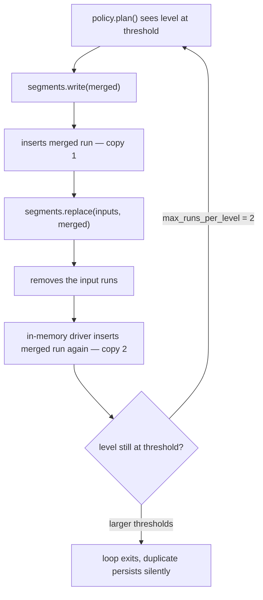

# Compaction Duplicate Runs and Quality Gates - Plan

## Goal Capsule

- **Objective:** Stop compaction storing each merged run twice, make `compact()` terminate for every legal configuration, and return both CI workflows to green.
- **Authority:** Requirements (R-IDs) govern behavior. Key Technical Decisions govern mechanism. Unit bodies override neither.
- **Execution profile:** Bug fix with regression coverage. U1 lands first because the current test suite hangs until it does.
- **Stop conditions:** Stop and surface if removing the stale PHPStan ignore in U6 makes the original `channel()` error reappear, or if the cross-driver conformance test in U3 reveals a third behavioral divergence beyond `replace()`.
- **Tail ownership:** Land on a new branch off `main`, separate from the open rename PR.

---

## Product Contract

### Summary

Fix the compaction defect that stores every merged run twice and can hang `compact()` forever, close the contract ambiguity that caused it, add the regression coverage that would have caught it, and clear the 8 static-analysis findings blocking the quality workflow.

### Problem Frame

`LsmTree::runCompaction()` calls `SegmentStoreInterface::write()`, which inserts the merged segment, and then calls `replace()`. `InMemorySegmentStore::replace()` inserts that same segment a second time. `FileSegmentStore` and `DatabaseSegmentStore` ignore the replacement argument and do not. The interface never states which behavior is correct, so all three implementations are defensible readings of the same contract.

On shipped defaults the duplicate is silent: reads stay correct because both copies hold identical entries, but the level holds two runs where one is expected, storage for that run doubles, and `statistics()->runs` overreports.

When the duplicate leaves a level sitting at exactly `max_runs_per_level`, the policy re-plans the same level forever. `max_runs_per_level: 2` is the minimum legal value and is settable through `LSM_MAX_RUNS`, so a supported configuration makes `compact()` never return.

This is why `tests/Unit/LsmTreeTest.php` hangs on `a_deleted_key_stays_deleted_through_compaction` — the tombstone-resurrection test `CONTRIBUTING.md` names as load-bearing. The hang exceeds the CI job timeout, so the `tests` workflow fails on every push, and the `quality` workflow fails independently on 8 PHPStan errors.

### Requirements

**Compaction correctness**

- R1. A compaction pass stores exactly one copy of the merged run.
- R2. `compact()` terminates for every legal configuration, including `max_runs_per_level: 2` at any `bottom_level`.
- R3. A compaction policy that never stops returning a plan raises a typed error instead of looping forever.

**Contract clarity**

- R4. `SegmentStoreInterface` states whether `replace()` inserts the replacement, so a new driver cannot guess wrong.

**Regression coverage**

- R5. Tests assert exact run counts after compaction, not just that runs exist.
- R6. All three shipped segment stores are checked against the same `replace()` expectations.

**Quality gates**

- R7. `composer analyse` reports no errors.
- R8. The `tests` and `quality` workflows both pass.

**Documentation accuracy**

- R9. Driver documentation names the actual configured default, and parser errors carry consistent source context.

### Scope Boundaries

- The package rename on branch `mdzahid-pro/split-into-multiple-commits` (PR #3) is unrelated and stays independent.
- Bloom filter sizing, the merge algorithm, and the WAL are unchanged — the audit found no defect in them.

#### Deferred to Follow-Up Work

- Raising Composer's 300s `process-timeout`. It is unnecessary once U1 lands: the suite finishes in about half a second.

---

## Planning Contract

### Key Technical Decisions

- KTD1. Correct `InMemorySegmentStore::replace()` rather than change the interface signature (session-settled: user-directed — chosen over removing the `$replacement` parameter from the contract: smallest change, and the two persistent drivers already implement the intended behavior). Governs R1.
- KTD2. Document the insert semantics on `SegmentStoreInterface::replace()` as part of the same change. The undocumented parameter is the root cause; fixing one driver without stating the rule leaves the next driver free to repeat it. Governs R4.
- KTD3. Bound the compaction loop by an iteration ceiling and raise a typed exception when it is hit (session-settled: user-directed — chosen over trusting the policy contract: a third-party policy can otherwise hang a queue worker with no diagnostic). Rejected a "total run count must strictly decrease" invariant: a custom single-run rewrite compaction is a legitimate 1-to-1 pass that the invariant would reject. Governs R3.
- KTD4. Fix all 8 static-analysis findings rather than suppress the cosmetic ones (session-settled: user-directed — chosen over a partial fix: `quality` is a required check and a stale suppression is itself one of the 8). Governs R7.
- KTD5. Land on a new branch off `main` (session-settled: user-directed — chosen over stacking onto PR #3: the rename should stay independently reviewable).
- KTD6. Treat the two `@phpstan-type SegmentDriver` parse errors as line-wrapping artifacts. The alias is written across two lines; PHPStan's PHPDoc parser requires one. The third finding — `@param` for `$resolver` resolving to `mixed` — is a consequence of the alias failing to parse, so joining the lines resolves both. Governs R7.

### High-Level Technical Design

The defect and its cycle:

Removing the second insert makes the level drop below the threshold, so the loop exits on the first pass and the stored run is unique. The iteration ceiling in U4 is a safety net for policies this package does not ship, not a fix for the cycle above.

### Assumptions

- The `channel()` suppression in `phpstan.neon.dist` is stale because Larastan now types the log manager. If removing it resurfaces the original error, the fallback is to keep the ignore and set `reportUnmatchedIgnoredErrors: false` — but verify before assuming.

---

## Implementation Units

### U1. Remove the duplicate insert and document the contract

- **Goal:** One stored copy per merged run, and an interface that states the rule.
- **Requirements:** R1, R4
- **Dependencies:** none — land first; the suite hangs until it does
- **Files:**
  - `src/Storage/InMemorySegmentStore.php`
  - `src/Contract/SegmentStoreInterface.php`
  - `tests/Unit/InMemorySegmentStoreTest.php` (new)
- **Approach:**
  1. Drop the `$replacement` insert from `InMemorySegmentStore::replace()`, leaving only the removal of obsolete segments. Keep the parameter — it stays in the interface signature.
  2. Add a docblock to `SegmentStoreInterface::replace()` stating that `write()` has already inserted the replacement and implementations must not insert it again. Name what `$replacement` is for: identifying the run that supersedes the obsolete set, for drivers that record lineage.
- **Patterns to follow:** `FileSegmentStore::replace()` and `DatabaseSegmentStore::replace()` already implement the intended behavior — match them.
- **Test scenarios:**
  - Writing a segment then calling `replace()` with it as the replacement leaves exactly one instance of that segment id in the level.
  - `replace()` with obsolete runs and a `null` replacement removes the inputs and adds nothing.
  - `replace()` with an id absent from the store throws `SegmentNotFoundException`.
  - `count()` after a replace equals the number of distinct segment ids across all levels.
- **Verification:** `tests/Unit/LsmTreeTest.php` completes instead of hanging, and the full suite passes.

### U2. Assert exact run counts after compaction

- **Goal:** Regression coverage that fails loudly on a duplicate instead of hanging.
- **Requirements:** R2, R5
- **Dependencies:** U1
- **Files:** `tests/Unit/LsmTreeTest.php`
- **Approach:** Add cases alongside the existing tombstone test. The current assertions use `assertGreaterThan(0, ...)`, which passes with a duplicate present — that is the gap that let this ship. Assert exact counts per level instead.
- **Execution note:** Write these against the unfixed code first and confirm they fail or hang; a test that passes before U1 is not covering the defect.
- **Test scenarios:**
  - After enough writes to trigger one compaction on shipped defaults, every level holds only distinct segment ids.
  - After one compaction, the merged level holds exactly one run.
  - With `max_runs_per_level: 2` and `bottom_level: 1`, `compact()` returns and the level holds one run.
  - With `max_runs_per_level: 2`, `statistics()->runs` equals the number of distinct stored runs.
- **Verification:** Each new case fails or hangs on the pre-U1 code and passes after it.

### U3. Check all three stores against the same replace() expectations

- **Goal:** Detect driver divergence on the shared contract instead of trusting three separate readings.
- **Requirements:** R6
- **Dependencies:** U1
- **Files:** `tests/Feature/SegmentStoreConformanceTest.php` (new)
- **Approach:** One test body, run against the memory, file and database stores. Lives under `tests/Feature/` because the database driver needs a booted application; the existing `tests/TestCase.php` provides it. Skip nothing — if a driver cannot satisfy the shared contract, that is the finding.
- **Test scenarios:**
  - For each driver: `write()` then `replace()` leaves one instance of the merged run.
  - For each driver: `levels()` returns runs newest-first within a level and shallowest level first, matching the interface docblock.
  - For each driver: `count()` equals the total number of distinct runs across levels.
  - For each driver: `replace()` with an unknown segment id throws `SegmentNotFoundException`.
- **Verification:** The suite passes for all three drivers with no per-driver special-casing in the assertions.

### U4. Bound the compaction loop

- **Goal:** A runaway policy fails with a diagnostic instead of hanging the process.
- **Requirements:** R3
- **Dependencies:** U1
- **Files:**
  - `src/LsmTree.php`
  - `src/Exception/CompactionStalledException.php` (new)
  - `tests/Unit/LsmTreeTest.php`
- **Approach:**
  1. Add `CompactionStalledException` implementing `LsmExceptionInterface`, matching the constructor and named-constructor style of the existing exceptions in `src/Exception/`.
  2. Count passes in `runCompaction()` and throw once the count exceeds a class constant ceiling. Use a generous default (1000) so no legitimate cascade trips it. The message should name the ceiling and the policy class so the failure is self-diagnosing.
  3. Correct the `compact()` docblock: it currently claims each pass strictly reduces the run count at the level it touches, which the guard no longer relies on.
- **Patterns to follow:** `src/Exception/LockTimeoutException.php` for a named constructor carrying context into the message.
- **Test scenarios:**
  - A stub policy that always returns a plan raises `CompactionStalledException` rather than looping.
  - The exception message names the ceiling and the offending policy class.
  - The shipped `SizeTieredCompactionPolicy` never trips the guard across the existing compaction tests.
  - `CompactionStalledException` is catchable as `LsmExceptionInterface`.
- **Verification:** The runaway-policy test terminates quickly; existing compaction tests are unaffected.

### U5. Clear the Laravel-layer static-analysis findings

- **Goal:** Five of the eight findings resolved, including one real type hole.
- **Requirements:** R7
- **Dependencies:** none
- **Files:**
  - `src/Laravel/LsmManager.php`
  - `src/Laravel/StoreFactory.php`
  - `src/Laravel/Storage/DatabaseSegmentStore.php`
  - `src/Laravel/LsmServiceProvider.php`
- **Approach:**
  1. Join each wrapped `@phpstan-type SegmentDriver` alias onto one line, in both `LsmManager.php` and `StoreFactory.php`. Per KTD6 this also clears the `@param ... mixed` finding on `extendSegments()`.
  2. Remove the unused `$container` constructor property from `LsmManager` and drop the corresponding argument at the construction site in `LsmServiceProvider`. The container is reached through `StoreFactory`, which is injected separately.
  3. Narrow the `@var` on the `levels()` row query in `DatabaseSegmentStore` from `list<object>` to the row shape `hydrate()` already documents. Extract that shape as a `@phpstan-type SegmentRow` alias and reference it from both places so they cannot drift.
- **Test scenarios:** No behavioral change intended. The existing `tests/Feature/DatabaseStoreTest.php` and `tests/Feature/StoreResolutionTest.php` must pass unchanged, proving the `$container` removal did not break resolution.
- **Verification:** `composer analyse` reports no findings in `src/Laravel/`.

### U6. Clear the core and configuration findings

- **Goal:** The remaining three findings resolved.
- **Requirements:** R7
- **Dependencies:** none
- **Files:**
  - `src/Parser/CsvLineParser.php`
  - `phpstan.neon.dist`
- **Approach:**
  1. Drop the unreachable `$columns === []` disjunct in `CsvLineParser::parse()`. `str_getcsv()` returns a non-empty list for the non-empty input that reaches this line, so only the `$columns[0] === null` check can fire.
  2. Remove the stale `ignoreErrors` entry for `channel()`. Confirm the original error does not reappear; if it does, keep the ignore and set `reportUnmatchedIgnoredErrors: false` rather than leaving an unmatched pattern.
- **Test scenarios:**
  - A blank CSV line still parses to `null`.
  - A line whose first column is empty still raises `MalformedOperationException`.
  - The existing `tests/Unit/ParserTest.php` cases pass unchanged.
- **Verification:** `composer analyse` reports zero errors across the whole of `src/`.

### U7. Correct the documentation inaccuracies

- **Goal:** Docs that match configured behavior, and consistent parser error context.
- **Requirements:** R9
- **Dependencies:** none
- **Files:**
  - `src/Storage/InMemorySegmentStore.php`
  - `src/Parser/CsvLineParser.php`
- **Approach:**
  1. The `InMemorySegmentStore` docblock calls it "the default driver", but `config/lsm.php` defaults segments to `database`. Reword to describe it as the zero-configuration and test driver.
  2. `CsvLineParser` reports an empty key column with a `csv line N:` prefix, but an unknown operation type arrives from `OperationType::fromInput()` with no source context. Give the parser the same prefixed context for the unknown-type case so import failures name the offending line.
- **Test scenarios:**
  - A CSV line with an unrecognised type raises an error naming the label and line number.
  - A CSV line with an empty type column raises an error naming the label and line number.
  - Existing `OperationType::fromInput()` behavior for direct callers is unchanged.
- **Verification:** Parser tests pass, and both error paths carry source context.

---

## Verification Contract

| Gate | Command | Applies to | Pass signal |
|---|---|---|---|
| Code style | `composer lint:test` | all units | Pint reports pass |
| Static analysis | `composer analyse` | U5, U6 | zero errors |
| Test suite | `composer test` | all units | all tests pass, completes in seconds |
| Full gate | `composer check` | before PR | style, analysis and tests all green |
| CI | `tests` and `quality` workflows | before merge | both green on the PR |

The suite must finish in seconds. A run that approaches Composer's 300s `process-timeout` means the hang is not actually fixed.

## Definition of Done

- R1 through R9 are satisfied.
- The full test suite passes with no hang; the pre-existing 68 tests still pass alongside the new cases.
- `composer analyse` reports zero errors.
- Every new test in U2 was confirmed to fail or hang against the pre-U1 code.
- A `CHANGELOG.md` entry is added under `## [Unreleased]`, per `CONTRIBUTING.md`.
- No exploratory or dead-end code remains in the diff.
- The work sits on a new branch off `main`, not on the rename branch.
